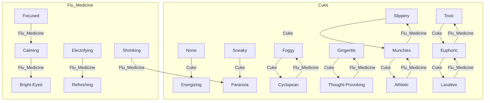

# mermaidの練習用
[Mermaid入門](https://zenn.dev/kento_mm_ninw/articles/8b10afdbef306a)参照

```mermaid
graph TD

subgraph Cuke
  None -->|Cuke| Energizing
  Toxic -->|Cuke| Euphoric
  Slippery -->|Cuke| Munchies
  Sneaky -->|Cuke| Paranoia
  Foggy -->|Cuke| Cyclopean
  Gingeritis -->|Cuke| Thought-Provoking
  Munchies -->|Cuke| Athletic
  Euphoric -->|Cuke| Laxative
end

subgraph Flu_Medicine
  Calming -->|Flu_Medicine| Bright-Eyed
  Athletic -->|Flu_Medicine| Munchies
  Thought-Provoking -->|Flu_Medicine| Gingeritis
  Cyclopean -->|Flu_Medicine| Foggy
  Munchies -->|Flu_Medicine| Slippery
  Laxative -->|Flu_Medicine| Euphoric
  Euphoric -->|Flu_Medicine| Toxic
  Focused -->|Flu_Medicine| Calming
  Electrifying -->|Flu_Medicine| Refreshing
  Shrinking -->|Flu_Medicine| Paranoia
end


```
